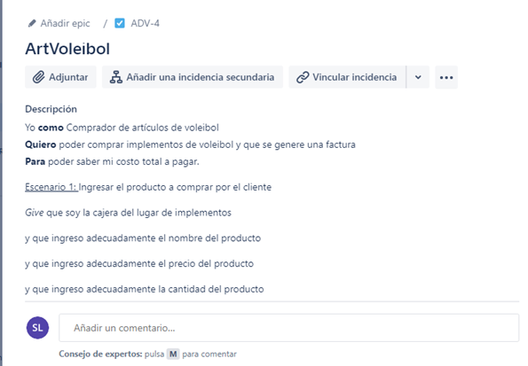
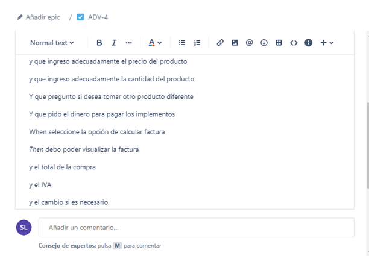
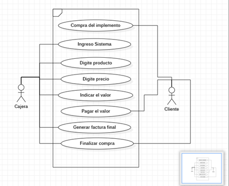
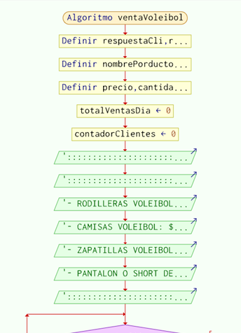
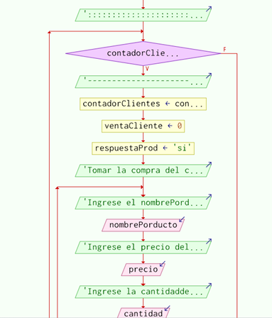
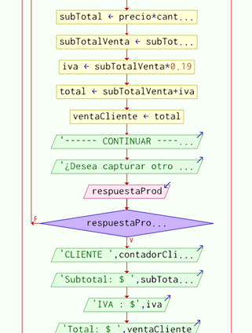
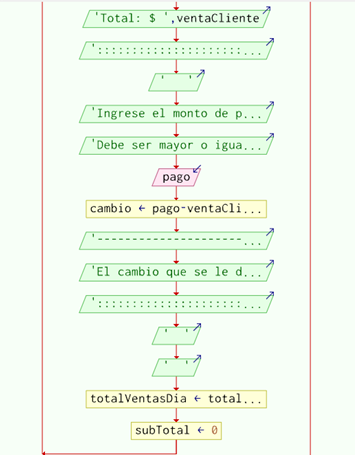
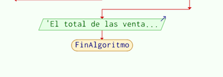

**Ejercicio Base:**

- En su labor como programador de software ha sido seleccionado para el desarrollo de una aplicación, la cual ayudará a una tienda que se dedica a vender implementos de voleibol. Esta aplicación jugará el papel “cajero” ya que este desea calcular la factura de cada venta que se vaya realizando. Como información básica se debe tener en cuenta el implemento que elija el cliente, precio del implemento, IVA del 19%,  
  
**Aclaraciones:**

- Se supondrá que la aplicación solo se requiere para calcular el valor total de la venta por cliente. 
- No se tiene almacenamiento de datos.
- No tiene verificación de datos.

**Análisis del ejercicio:**

Aproximación Plantilla Historia de Usuario:

**Descripcion de caso de uso**

*Nombre:* Compra de implementos de voleibol
*Actores:* cajera y cliente
*Propósito:* Realizar una compra de un implemento y generar factura.

*Curso normal de eventos:*
- El cliente indica que implementos desea
- El cliente indica la cantidad de cada implemento
- La cajera ingresa el nombre de los implementos
- La cajera ingresa el precio y cantidad de los implementos a comprar
- Se calcula el valor a pagar sumando un IVA de 19%
- Se indica el valor a pagar al cliente
- El cliente nos da el monto para pagar
-  Se genera la factura, con cambio sí es dado el caso

**Aproximacion diagrama de flujo**

**Aproximación Pseudocódigo:**
Algoritmo ventaVoleibol
	Definir respuestaCli, respuestaProd Como Caracter
	Definir nombrePorducto como Cadena 
	Definir precio, cantidad, subTotal, total, subTotalVenta, iva, totalVentas, totalVentasDia, pago, cambio, ventaCliente Como Real
	totalVentasDia <- 0
	contadorClientes <- 0
	
	Escribir ":::::::::::::::::::::::::::::::::::::::::::::::::::::::::::::::::::::::::::::"
	Escribir "::::::::::::::::::::::::: MENU DE IMPLEMENTOS ::::::::::::::::::::::::::::::: "
	Escribir "- RODILLERAS VOLEIBOL: $50.000"
	Escribir "- CAMISAS VOLEIBOL: $30.000"
	Escribir "- ZAPATILLAS VOLEIBOL: $280.000"
	Escribir "- PANTALON O SHORT DE LICRA: $35.000"
	Escribir ":::::::::::::::::::::::::::::::::::::::::::::::::::::::::::::::::::::::::::::"
	
	Mientras contadorClientes < 3 Hacer
		Escribir "---------------------------------------"
		contadorClientes <- contadorClientes + 1
		ventaCliente <- 0
		respuestaProd <- "si"
		Escribir "Tomar la compra del cliente ", contadorClientes,"  "
		
		Repetir
			Escribir "Ingrese el nombre del producto"
			Leer nombrePorducto
			Escribir  "Ingrese el precio del producto"
			Leer precio
			Escribir "Ingrese la cantidad de productos"
			Leer cantidad
			
			subTotal <- precio * cantidad
			subTotalVenta <- subTotalVenta + subTotal
			iva <- subTotalVenta * 0.19
			total <- subTotalVenta + iva
			
			ventaCliente <- total
			Escribir  "------ CONTINUAR -------"
			Escribir  "¿Desea capturar otro producto? (si/no)"
			Leer respuestaProd
		Hasta Que respuestaProd = "no" 
		Escribir "CLIENTE ", contadorClientes, "     "
		Escribir "Subtotal: $ ", subTotalVenta
		Escribir "IVA : $", iva
		Escribir "Total: $ ", ventaCliente
		Escribir ":::::::::::::::::::::::::::::::::::::::::::::::"
		Escribir "   " 
		Escribir "Ingrese el monto de pago del cliente", contadorClientes
		Escribir "Debe ser mayor o igual el total a pagar ( $ " ventaCliente ")"
		Leer pago
		
		cambio <- pago - ventaCliente
		Escribir "----------------------------------------------"
		Escribir "El cambio que se le dara al cliente: ", contadorClientes, " es de $ ", cambio
		Escribir "::::::::::::::::::::::::::::::::::::::::::"
		Escribir "  "
		Escribir "  "
		totalVentasDia <- totalVentasDia + ventaCliente 
		subTotal <- 0
	FinMientras
	 Escribir  "El total de las ventas en el dia fueron de: $ ", totalVentasDia
FinAlgoritmo

